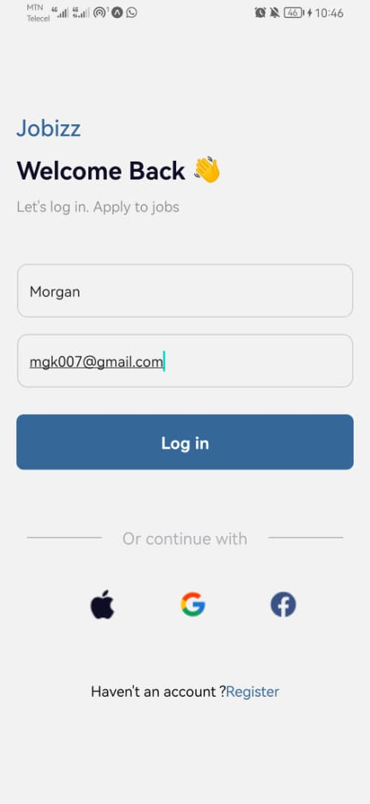
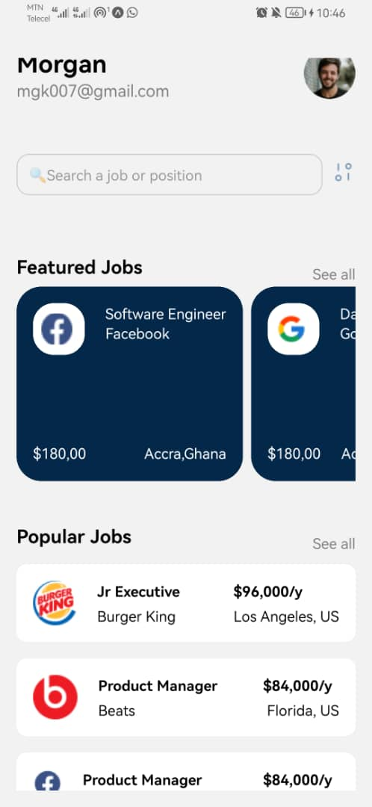

# rn-assignment4-11079266

# Jobizz App

Jobizz is a React Native app for job seekers to log in and view job listings.

## Components

### `App.js`
- **Description**: Main entry point, sets up navigation between `LoginPage` and `HomePage`.

### `LoginPage.js`
- **Description**: Login screen with name and email input fields. Navigates to `HomePage`.
- **Usage**: Includes `CustomButton` for login and social media icons.

### `HomePage.js`
- **Description**: Displays featured and popular job listings.
- **Usage**: Shows jobs in a scrollable list, receives `name` and `email` via navigation.

### `CustomButton.js`
- **Description**: Custom button component used in `LoginPage`.
- **Usage**: Takes `title` and `onPress` props.

### `JobCard.js`
- **Description**: Displays individual job details.
- **Usage**: Shows job title and company name.

## Installation

1. Clone the repository.
2. Run `npm install`.
3. Start the app with `npm start`.

# screenshot

